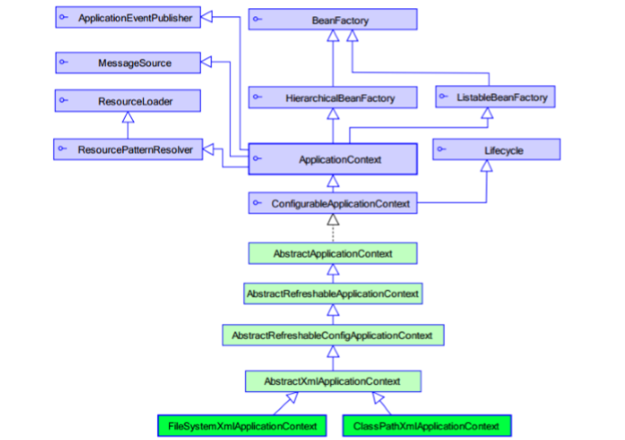

# Spring 
[toc]

## Spring 概述


### Spring 简介和发展
Spring --> 春天   
Rod Johnson（spring之父，音乐专业）    
- Expert One-to-One J2EE Design and Development(2002)    
雏形 interface21 框架，主要目的是为了简化 EJB 开发   
- Expert One-to-One J2EE Development without EJB(2004)    
在 Interface21 的基础上发布了 1.0 Rod Johnson       
- 2017 年 9 月份发布了 spring 的最新版本 spring 5.0 通用版（GA）
- 理念 让技术更加实用方便。  

官网：[http://spring.io/](http://spring.io/)  
官网下载地址：[https://repo.spring.io/libs-release-local/org/springframework/spring/](https://repo.spring.io/libs-release-local/org/springframework/spring/)  
GitHub：[https://github.com/spring-projects](https://github.com/spring-projects) 


### Spring 特点
 - Spring 是一个开源得免费的框架，容器
 - Spring 是一个轻量级的，非入侵式的框架。
 - 主要是支持 控制反转 IoC 和 面向切面 AOP
 - 对事务的支持性很好，能够支持对其他框架支持


概要
 1. IoC 方便解耦
    - 使用 Spring IoC 容器，可以将对象的依赖关系交给 Spring 控制(原先需要 new 的对象让 Spring 解决，减少编译期等 依赖错误)，单例模式类和多例模式类和控制文件能够直接 Spring 去做。
2. AOP 面向切面编程，提供可扩展性
    
3. 支持声明事务
    - 可以将我们从单调烦闷的事务管理代码中解脱出来，通过声明式方式灵活的进行事务的管理， 提高开发效率和质量。 

 总结：Spring 是一个免费的轻量级的控制反转(IoC)和面向切面（AOP）的容器（框架）


### 体系架构组成

  
    可以通过 Spring 的体系结构了解其和兴内容和特点，支持的组件，七个模块都是定义在核心容器之上的，核心容器定义了创建，配置和管理 bean 的方式。


     


组成每一个框架模块的主组件都可以单独存在，或者是和其他模块相联合实现。

- 核心容器：核心容器中提供了 Spring 的基本功能，核心组件时 `BeanFactory` ，属于工厂模式的一种实现。`BeanFactory` 使用控制反转（IoC）， 模式将应用程序的配置和依赖规范与实用的应用程序代码分开。
- Spring 上下文：Spring 上下文的配置文件，给 Spring 框架提供上下文信息，可以包含企业的服务，包括 EJB， 邮件，DBDL ，校验等的支持。

- Spring AOP ： AOP 的功能直接集成到了 Spring 框架中，提供了符合AOP Alliance规范的面向方面的编程实现，例如方法拦截器（method-interceptors）和切点（pointcuts），从逻辑上讲，从而减弱代码的功能耦合，清晰的被分离开。，
- Spring DAO ：JDBC DAO 抽象层提供了有意义的异常层次结构，可用该结构来管理异常处理和不同数据库供应商抛出的错误消息。异常层次结构简化了错误处理，并且极大地降低了需要编写的异常代码数量（例如打开和关闭连接）。Spring DAO 的面向 JDBC 的异常遵从通用的 DAO 异常层次结构。
- Spring ORM ：pring 框架插入了若干个 ORM 框架，从而提供了 ORM 的对象关系工具，其中包括 JDO、Hibernate 和 iBatis SQL Map。所有这些都遵从 Spring 的通用事务和 DAO 异常层次结构。
- Spring Web 模块：Web 上下文模块建立在应用程序上下文模块之上，为基于 Web 的应用程序提供了上下文。所以，Spring 框架支持与 Jakarta Struts 的集成。Web 模块还简化了处理多部分请求以及将请求参数绑定到域对象的工作。
- Spring MVC 框架：MVC 框架是一个全功能的构建 Web 应用程序的 MVC 实现。通过策略接口，MVC 框架变成为高度可配置的，MVC 容纳了大量视图技术，其中包括 JSP、Velocity、Tiles、iText 和 POI。


## IoC 基础

**分析原有实现方式**
1、先写一个 UserDao 接口
```java
public interface UserDao {
    public void getUser();
}
```
2、实现 UserDao

```java
public class UserDaoImpl implements UserDao {
    @Override
    public void getUser() {
        System.out.println("获取用户数据");
    }
}
```
3、增加一个 Service 接口
```java
public interface UserService {
    public void getUser();
}
```
4、实现 Service 接口

```java
public class UserServiceImpl implements UserService {
    private UserDao userDao = new UserDaoImpl();
    @Override
    public void getUser() {
        userDao.getUser();
    }
}

```

5、测试一些创建的情况

```java
@Test
    public void test(){
        UserServiceImpl service = new UserServiceImpl();
        service.getUser();
    }
```
上面的步骤是一个正常编写的步骤  
我们增加一个 UserDao 实现类

```java
public class UserDaoMySQLImpl implements UserDao {
    @Override
    public void getUser() {
        System.out.println("Mysql 获取用户数据");
    }
}
```
如果需要使用的话，需要到 service 实现类中去修改
```java
public class UserServiceImpl implements UserService {
//    private UserDao userDao = new UserDaoImpl();
    private UserDao userDao = new UserDaoMySQLImpl();
    @Override
    public void getUser() {
        userDao.getUser();
    }
}
```

如果后面我们再使用其他的方式（Oracle 或者 SQL service）去实现的话，还得需要修改对应的 service 层的代码。耦合性太高，实现了正所谓牵一发而动全身。

如果使用 set 的方式，把创建的能力权限给使用者的话是什么样的呢？
```java
public class UserServiceImpl implements UserService {
    private UserDao userDao ;
    public void setUserDao(UserDao userDao) {
        this.userDao = userDao;
    }
    @Override
    public void getUser() {
        userDao.getUser();
    }
}
```
测试

```java
 @Test
    public void test(){
        UserServiceImpl service = new UserServiceImpl();
        service.setUserDao(new UserDaoImpl());
        service.getUser();
        service.setUserDao(new UserDaoOracleImpl());
        service.getUser();
        service.setUserDao(new UserDaoMySQLImpl());
        service.getUser();
    }
```
虽然代码改动不大，但是本质已经发生了很大的改变，本来对象的管理权限是属于程序员本身，但是通过这种方式，对象的管理权限交给了用户。 IoC 的原型，能够大大降低程序的耦合性。


### IoC 本质
**IoC 控制反转（Inversion of Control）是属于一种思想，DI（依赖注入）是实现 IoC 的一种方法** 
没有IoC的程序中 , 我们使用面向对象编程 , 对象的创建与对象间的依赖关系完全硬编码在程序中，对象的创建由程序自己控制，控制反转后将对象的创建转移给第三方，个人认为所谓控制反转就是：获得依赖对象的方式反转了。


IoC 属于 Spring 的核心，可以使用多种方式实现 IoC，可以使用 XML 配置，或者使用注解的方式，最新的还能使用 Spring 的零配置实现。  

Spring 容器在初始化的时候先读取配置文件，然后再把元数据创建和组织对象存入到容器中，程序使用时，再从 IoC 容器中取出对象。


### 基于XML配置的 Spring IoC细节


   
    BeanFactory 是我们用的 spring 容器的顶层接口，我们常用到的接口是 ApplicationContext 接口。  
    在选择不同配置文件载入时常使用实现类 ClassPathXmlApplicationContext 和 FileSystemXmlApplicationContext。针对常用的接口和实现类的细节如下。  

###  BeanFactory 和 ApplicationContext 区别
    1. BeanFactory 是 Spring 容器中的顶层接口。
    2. ApplicationContext 是 BeanFactory 的子接口。
    3. 两者使用时创建的时间不同：
        ApplicationContext 只要一读取配置文件，默认情况就会创建（单例）
        BeanFactory： 只在使用时创建

### ApplicationContext 常用接口实现类
    ClassPathXmlApplicationContext：  它是从类的根路径下加载配置文件  推荐使用这种
    FileSystemXmlApplicationContext：  它是从磁盘路径上加载配置文件，配置文件可以在磁盘的任意位置。
    AnnotationConfigApplicationContext: 当我们使用注解配置容器对象时，需要使用此类来创建 spring 容器。它用来读取注解。 

### Beans
Beans 是 Spring 核心之一，用于配置文件让 Spring 来创建。默认情况调用类中的无参构造函数，如果没有无参构造函数，调用创建不成功

**属性**  

    id：给对象在容器中提供一个唯一标识。用于获取对象。  
    class：指定类的全限定类名。用于反射创建对象。默认情况下调用无参构造函数。  
    scope：指定对象的作用范围。  
    singleton :默认值，单例的。  
    * prototype :多例的.   
    * request :WEB 项目中,Spring 创建一个 Bean 的对象,将对象存入到 request 域中.    
    * session :WEB 项目中,Spring 创建一个 Bean 的对象,将对象存入到 session 域中.    
    * global session :WEB 项目中,应用在 Portlet 环境.如果没有 Portlet 环境那么globalSession 相当于 session. 
    init-method：指定类中的初始化方法名称。 
    destroy-method：指定类中销毁方法名称
**bean 的作用范围和生命周期：**

    单例对象：scope="singleton"   
    一个应用只有一个对象的实例。它的作用范围就是整个引用。   
    生命周期：    
        对象出生：当应用加载，创建容器时，对象就被创建了。    
        对象活着：只要容器在，对象一直活着。    
        对象死亡：当应用卸载，销毁容器时，对象就被销毁了。  
    多例对象：scope="prototype"   
    每次访问对象时，都会重新创建对象实例。   
    生命周期：    
        对象出生：当使用对象时，创建新的对象实例。    
        对象活着：只要对象在使用中，就一直活着。    
        对象死亡：当对象长时间不用时，被 java 的垃圾回收器回收了。 

