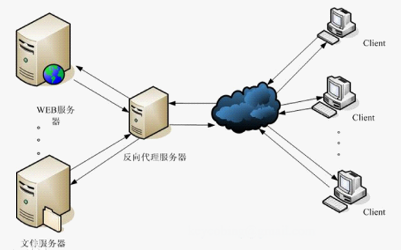

# 高并发

### 顺序读写和随机读写的区别
- 在机械硬盘中，顺序读写的速度和随机读取的速度的 100 多倍，因为在随机存储的过程中磁盘需要换道，磁头换道需要消耗大量的时间。（当以不同的数据块单位读取时也会有差距）
- 在固态硬盘中，顺序读写的速度和随机读写的

### 反向代理（nginx）
- [what] 
通常的代理服务器，只用于代理内部网络对Internet的连接请求，客户机必须指定代理服务器,并将本来要直接发送到Web服务器上的http请求发送到代理服务器中由代理服务器向Internet上的web服务器发起请求.  
**反向代理**（Reverse Proxy）方式是指以代理服务器来接受internet上的连接请求，然后将请求转发给内部网络上的服务器，并将从服务器上得到的结果返回给internet上请求连接的客户端
- [why] 
能够防止用户获取的服务器的一些信息，增加服务的安全性
- [how] 

### Nginx 的 Session 一致性（分布式）
- [what]   
Session 是一段标识或者一段数据，常见形式有 会话cookie（生命周期太短，本次浏览器的访问结束，存在内存中）  
- [why]  
由于 http 访问是没有状态的，重复多次访问时均识别未一次新的访问，在需要记住用户的时候,增加 session 机制作为验证，但是如果是在负载均衡中每一次分发的机器不同，session 就会不同，和下次访问取不到 session 数据的情况。 
- [how]  
1、tomcat 自带的复制
2、使用 session 的共享，专门管理 session 的软件，内存存储 memchached 或者 redis 。

